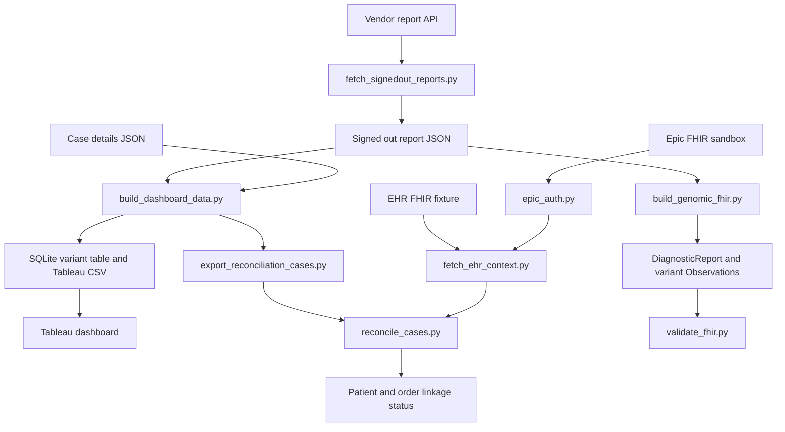

# Molecular Oncology FHIR Tableau Analytics

**Molecular diagnostic results, FHIR EHR context, and Tableau analytics**

This project transforms signed out molecular oncology reports into a variant table for Tableau and links report cases to EHR context represented as FHIR R4 resources. The public workflow uses invented patient and laboratory records with five published gene and variant combinations ([variant references](docs/variant_references.md)).
The vendor and Epic sandbox are separate systems. The example data illustrates the linkage workflow; it does not represent a match between a clinical vendor report and an Epic sandbox patient.

## Architecture



The local FHIR fixture is used for five reproducible matched cases. The optional Epic sandbox branch demonstrates authenticated FHIR reads separately. It has no matching vendor case in this repository.

## What the pipeline produces

- A `patient_reportsQ` SQLite view with accession, disease, gene, transcript, cSyntax, pSyntax, classification, VAF, depth, specimen type, interpretation, and variant frequencies.
- A Tableau ready CSV exported from that view.
- A reconciliation result for each case: `matched`, `missing_patient`, `missing_order`, `patient_mismatch`, or `ambiguous_identifier`.
- An illustrative FHIR R4 `DiagnosticReport` with linked genomic `Observation` resources.

The generated Bundle receives local structural, code, and reference checks. Those checks do not establish conformance to every requirement in the HL7 Genomics Reporting implementation guide.

## Reproduce the five cases

Run these commands from the repository root. Python 3.10 or newer is required. The fixture path contains only invented identifiers.

```bash
python3 src/molecular_bridge/analytics/build_dashboard_data.py --reports-dir examples/input/vendor_reports --case-details-dir examples/input/case_details --accession-prefix MD --database examples/output/dashboard.sqlite --export-csv examples/output/tableau_signedout_variants.csv
python3 src/molecular_bridge/fhir/fetch_ehr_context.py --fixture examples/input/ehr_bundle.json
python3 src/molecular_bridge/integration/export_reconciliation_cases.py --database examples/output/dashboard.sqlite --output examples/output/reconciliation_cases.json
python3 src/molecular_bridge/integration/reconcile_cases.py --vendor examples/output/reconciliation_cases.json --ehr examples/output/ehr_context.json --database examples/output/demo.sqlite
python3 src/molecular_bridge/fhir/build_genomic_fhir.py
python3 src/molecular_bridge/fhir/validate_fhir.py
python3 -m unittest discover -s tests -p 'test_molecular_bridge.py' -v
```

The five cases `MD-001` through `MD-005` should match `Patient/p001` through `Patient/p005` and their corresponding orders. The Tableau CSV should contain five findings with specimen types, including `FLT3` in `Bone marrow`. Repeating the commands should not duplicate the SQL report or reconciliation row.

## Repository layout

| Path | Purpose |
| --- | --- |
| `src/molecular_bridge/vendor/fetch_signedout_reports.py` | Optional vendor API download of the latest signed out JSON report |
| `src/molecular_bridge/analytics/build_dashboard_data.py` | Parse reports, load SQLite, calculate variant frequencies, export Tableau CSV |
| `src/molecular_bridge/integration/export_reconciliation_cases.py` | Select the current report for each case from SQLite |
| `src/molecular_bridge/integration/reconcile_cases.py` | Compare accession and MRN with FHIR patient and order identifiers |
| `src/molecular_bridge/fhir/epic_auth.py` | SMART standalone authorization for the optional Epic sandbox branch |
| `src/molecular_bridge/fhir/fetch_ehr_context.py` | Read Epic FHIR resources or load the EHR fixture |
| `src/molecular_bridge/fhir/build_genomic_fhir.py` | Produce an illustrative genomic FHIR Bundle from a case |
| `src/molecular_bridge/fhir/validate_fhir.py` | Perform basic local Bundle checks |
| `examples/input/` | Patient report, case details, vendor case list, and EHR resources |
| `examples/output/` | Generated local results; excluded from Git |
| `tableau/` | Workbook and screenshot |

## Optional Epic sandbox read

Register a public SMART standalone app in [Epic on FHIR](https://fhir.epic.com/Developer/Apps), set the callback URL to `http://127.0.0.1:8765/callback`, and configure the patient scopes supported for your app. Then run:

```bash
EPIC_CLIENT_ID=YOUR_CLIENT_ID python3 src/molecular_bridge/fhir/epic_auth.py
python3 src/molecular_bridge/fhir/fetch_ehr_context.py --patient-id YOUR_SANDBOX_PATIENT_ID --output .local/epic_context.json
```

The first script keeps the access token in `.local/`, which is excluded from Git. The second retrieves available FHIR resources for a sandbox patient. Resource availability depends on the registered app, scopes, and chosen sandbox patient. **Do not run case reconciliation against the live sandbox output.** Live Epic access is an optional branch and should be reported as tested only after an actual authorized run.

## Tableau

Connect Tableau to `examples/output/tableau_signedout_variants.csv` to recreate the signed out variant table with filters for disease, gene, variant type, classification, VAF, and depth. A public workbook and screenshot must be built from the CSV.

## Data handling and limitations

Real vendor reports and SQL exports can contain MRNs, names, dates of birth, and interpretations. Keep all real inputs and outputs outside this repository. The fixtures use the invented `urn:example:mrn` and `urn:example:accession` identifier systems. Real EHR linkage requires an approved identifier mapping and governance. The vendor API authentication and report structure must be verified in an authorized environment. The genomic Bundle is an illustrative subset; use an HL7 FHIR validator and the published Genomics Reporting profiles before making a profile conformance claim.

## Maintainer

Ratilal Akabari
Senior Bioinformatics Scientist
Upstate Medical University
